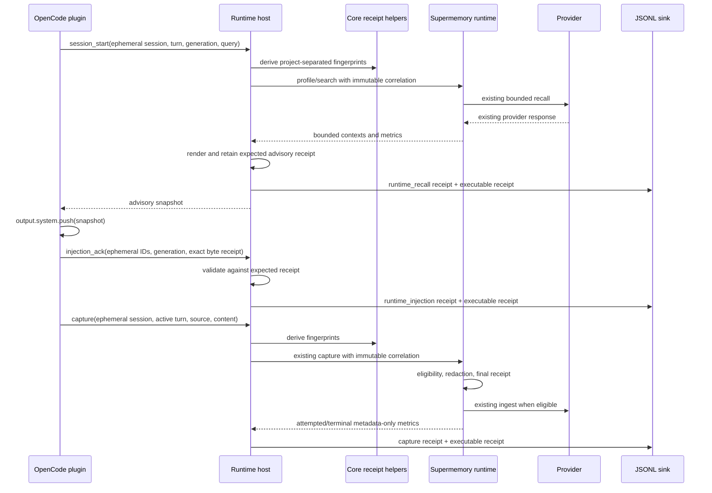

# Design: Adaptive Memory Observability Receipts

## Decisions

1. Core owns pure, provider-neutral receipt math.
2. The authenticated runtime host validates ephemeral native IDs and derives persisted fingerprints; the plugin and model never provide persisted fingerprints.
3. Adapter-supermemory receives immutable per-call correlation metadata so concurrent calls cannot share mutable current-turn state.
4. Recall and injection are distinct evidence: recall hashes the exact advisory returned; injection acknowledges the exact snapshot actually pushed.
5. The host retains a bounded, expiring expected-injection receipt keyed by ephemeral session, logical turn, and generation. No raw key is persisted.
6. Executable evidence is byte-backed. Alias names and environment variables are not authoritative for the running process.
7. The existing JSONL v1 event remains additive; its explicit allowlist is the privacy boundary.

## Receipt fields

| Field | Source | Meaning |
|---|---|---|
| `sessionFingerprint` | core helper over host-validated IDs and scope fingerprint | Project-separated native session |
| `logicalTurnFingerprint` | core helper over host-validated IDs and scope fingerprint | Project-separated logical user turn |
| `captureSource` | canonical capture source | Trusted input/output class, never content |
| `inputByteCount`, `inputSha256` | exact normalized+redacted capture bytes | Capture candidate/payload receipt |
| `snapshotGeneration` | validated OpenCode snapshot generation | Stale-turn guard and join key |
| `injectedByteCount`, `injectedSha256` | exact rendered/pushed advisory bytes | Recall/injection equality proof |
| `hostExecutableSha256`, `hostExecutableByteCount` | actual process-image bytes | Executing host payload receipt |
| `hostExecutableSource` | host constant | `proc-self-exe` or `process-exec-path` |
| `hostExecutableKind` | digest-backed classification | `deck-canary` or `other` |

## Sequence

## Trust boundaries

- Native IDs and provider correlation remain ephemeral inside authenticated loopback/runtime memory.
- Full SHA-256 fingerprints are deterministic equality receipts, not authentication tokens.
- Content SHA-256 proves byte equality when an auditor holds candidate bytes; low-entropy candidate guessing remains possible and is a documented residual privacy limit.
- `/proc/self/exe` is the strong Linux source for the already-running image. `process.execPath` is a lower-trust path snapshot on other platforms.
- A local same-user process with the ephemeral bearer can forge loopback events; this pre-existing same-user trust boundary is unchanged.

## Failure behavior

- Receipt/sink/executable failures remain fail-open and never suppress recall, capture, or model execution.
- Invalid or stale injection acknowledgments produce no successful injection metric.
- Missing advisory produces no injection expectation or acknowledgment.
- Provider failures retain metadata-only capture/recall receipts.
- No error diagnostic may include a path or raw rejected value.
