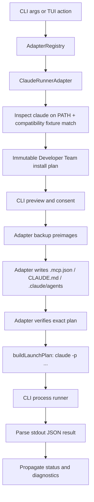

# Design: Claude Code CLI Runner Support

## Architectural decision

Unlike the Codex change, this proposal does **not** need to add or change any type in
`packages/core/src/runner-adapter.ts`. `RunnerLaunchInput`, `RunnerLaunchPlan`,
`RunnerLaunchResult`, and the full `RunnerAdapter` interface already exist in their final,
runner-neutral shape (they were built for Codex and generalized). `@deck/adapter-claude` is a
pure addition: a new package plus a small registration diff.

The one architectural decision this proposal does make explicitly, because it was genuinely
open, is **subprocess vs. Claude Agent SDK**. Decision: **subprocess** (`claude -p ...`),
launched by the CLI exactly like Pi/OpenCode/Codex.

Rationale:
- Every existing adapter conforms to "adapter plans a command, CLI spawns it, adapter never
  owns the process" (`runner-adapter.ts:732`, "The CLI remains the sole process owner"). The
  Agent SDK runs Claude in-process as a library call — there is no external command to plan.
  Fitting it into `RunnerLaunchPlan` would mean either faking a command/args shape that doesn't
  describe what actually happens, or extending the shared contract with an in-process launch
  variant that every other adapter would need to account for (dashboard rendering, doctor,
  upgrade sync, etc. all consume `RunnerLaunchPlan`).
- Every capability this proposal needs — session resume, per-launch system-prompt injection,
  structured JSON result, MCP config — is reachable through `claude -p` flags. The SDK's
  advantages (no subprocess overhead, typed config, dynamic `canUseTool` callback) matter more
  for someone building a bespoke agent than for orchestrating a user's already-installed CLI,
  which is what Deck does for every other runner.
- Lower risk, faster to a working vertical, and consistent with how Codex — the most recently
  added adapter — was actually built.

This is revisited only if a future change needs a capability that genuinely requires the SDK
(e.g., a dynamic per-tool-call approval callback that no CLI flag can express).

**Considered and rejected alternative:** a thin wrapper script that itself embeds the Agent SDK
internally, spawned as an external `command`/`args` process so it still fits
`RunnerLaunchPlan`'s literal shape. This was raised during independent review and is not
technically ruled out by the contract — but it was rejected here because it would bundle the
SDK as a Deck dependency solely for this one runner and would stop using the user's own
already-installed `claude` binary as-is, which is the property that makes the subprocess
approach simple and consistent with every other adapter. Not adopted, but recorded so the
option isn't silently unexamined.

## Target flow



## Launch contract (reused, not modified)

```ts
// Already exists in packages/core/src/runner-adapter.ts — no changes needed.
export type RunnerLaunchInput =
  | (RunnerLaunchBase & { mode: "interactive" })
  | (RunnerLaunchBase & { mode: "exec"; prompt: readonly string[]; stdin: "inherit" | "closed"; stdinPayload?: RunnerStdinPayload })
  | (RunnerLaunchBase & { mode: "resume-by-id"; sessionId: string })
  | (RunnerLaunchBase & { mode: "resume-latest" });
```

`buildClaudeLaunchPlan()` in the new adapter mirrors
`packages/adapter-codex/src/launch.ts:buildCodexLaunchPlan()` closely:

- `interactive`: `command: "claude"`, no forced flags beyond Deck's launch-policy token,
  `stdio: "inherit"`.
- `exec`: `command: "claude"`, `args` includes `-p` (print/headless) plus
  `--output-format json` (Phase 0 confirms exact flag), prompt delivered via `stdinPayload`
  (never argv), `stdio: "pipe"`.
- `resume-by-id`: adds `--resume <sessionId>` (Phase 0 confirms exact flag) after validating
  the session id is an opaque non-option value, matching Codex's validation at
  `launch.ts:100-106`.
- `resume-latest`: adds `--continue` (Phase 0 confirms exact flag).
- `interactive`/`exec` (new-session modes) pass `input.modelId` through as a `--model` flag
  when present, bounded/validated the same way as the policy token — mirroring Codex's
  `launch.ts` handling of `input.modelId`. Resume modes never reinject a model override.
- Every new-session mode gets exactly one fixed Deck-owned policy token inserted first in
  `args`, with the same `hasOwnedBypassPolicy`-style invariant check Codex uses
  (`launch.ts:74-78`) — if the check fails, return `status: "blocked"`, never launch with an
  uncertain policy.

## Deck's fixed launch-policy token (CONFIRMED in Phase 0)

Three candidate mechanisms exist in `claude --help`: `--dangerously-skip-permissions`,
`--allow-dangerously-skip-permissions` (a gate that gates the former "as an option, without it
being enabled by default"), and `--permission-mode bypassPermissions` (one enum value of the
general session-mode selector). Tested all three live rather than picking by name similarity to
Codex's `--dangerously-bypass-approvals-and-sandbox`:

- `--dangerously-skip-permissions` alone → a Bash tool call was **denied**: `"Permission for
  this action was denied by the Claude Code auto mode classifier."` — an undocumented
  automatic-safety layer that evaluates actions independent of this flag.
- `--dangerously-skip-permissions` combined with `--allow-dangerously-skip-permissions` → same
  denial, same classifier message. The "allow" flag does not change the outcome.
- `--permission-mode bypassPermissions` alone → the Bash tool call **succeeded**
  (`is_error: false`, `permission_denials: []`, `result: "Done. The command output is:
  \`hello-from-bypass-test\`"`).

**Decision:** Deck's fixed launch-policy token is `--permission-mode bypassPermissions`, not
`--dangerously-skip-permissions`. The name-similarity to Codex's flag would have been a
plausible but wrong guess — real behavior, not naming convention, decided this. This is the
value REQ-CLD-RUN-002/003 (`spec.md`) refer to as Deck's "single, fixed, adapter-owned
permission-policy token."

## Output capture — the one real design gap vs. Codex (CONFIRMED in Phase 0)

Codex's `outputCapture` contract (`runner-adapter.ts:215-224`) assumes a **file-based** final
message: Codex writes `--output-last-message <tmpfile>` and Deck reads that file after exit.

Confirmed against a live install (`claude --help` shows no `--output-last-message` or any
file-output flag at all, and a real run settled the question definitively):

```
$ claude -p --model haiku --output-format json "Reply with exactly the word: OK"
{"duration_api_ms":1840,"stop_reason":"end_turn","session_id":"fdacf75d-...",
 "total_cost_usd":0.0195328,"usage":{...},"result":"OK","is_error":false,
 "num_turns":1,"subtype":"success","type":"result","duration_ms":3126,...}
```

The full result — including the final assistant text in `result`, `session_id`, `is_error`,
`subtype`, `total_cost_usd`, and `usage` — is a single JSON object printed directly to
**stdout**. There is no file-based channel; Claude Code has no equivalent of Codex's
`--output-last-message`.

**Decision, corrected during Phase 2 implementation:** Option 1 (adapter redirects captured
stdout to a Deck-managed tmpfile, keeping `source: "file"`) turned out to be unimplementable as
originally stated. Reading `apps/cli/src/runner-launch-command.ts`'s
`trustedFinalAssistantMessage()` showed it only ever *reads* the path in `contract.path` — it
never writes one. Codex's file-based contract works because the `codex` *subprocess itself*
writes that file via `--output-last-message <path>`; nothing in the CLI populates it generically.
Claude has no equivalent flag, so a `source: "file"` contract for Claude would have pointed at a
path nothing ever writes, silently producing no final message on every exec launch — a real bug,
not a theoretical one, caught by reading the consumer before shipping rather than after.

**Actual decision:** added a `"stdout"` variant to
`RunnerLaunchPlan.outputCapture.finalAssistantMessage` in `packages/core/src/runner-adapter.ts`
(now a discriminated union: `{ source: "file"; path: string; ... }` or
`{ source: "stdout"; ... }`, no path), plus a matching branch in
`trustedFinalAssistantMessage()` that reads the already-captured, already-redacted process
stdout directly instead of touching the filesystem. This is a small, deliberate, user-approved
change to shared code (not Claude-specific) — Pi/OpenCode/Codex are unaffected (confirmed via a
stash-based before/after full-suite run with an identical failing-test set). Claude's exec plan
sets `source: "stdout"`, `route: "claude-exec-stdout-json"`.

The captured content is Claude's raw JSON result object (containing `result`, `session_id`,
`is_error`, `total_cost_usd`, `usage`, etc.), not yet narrowed to just the `result` field — every
exec launch plan carries an explicit `info`-severity `claude-output-capture-raw-json` diagnostic
flagging that JSON extraction is Phase 4 (verification/doctor) work, not silently deferred.

## Package layout

New package `packages/adapter-claude/`, mirroring `packages/adapter-codex/src/` (19 files /
~7.4k lines is the reference scale for a "beta, static-compatible" adapter — Claude's initial
release is not expected to reach that size on day one; later phases add to it):

| File | Responsibility | Codex precedent |
|---|---|---|
| `index.ts` | Barrel export | `adapter-codex/src/index.ts` |
| `types.ts` | Fixture/mutation/preimage types | `adapter-codex/src/types.ts` |
| `compatibility.ts` | Captured `claude --help` fixtures, version→feature mapping | `adapter-codex/src/compatibility.ts` |
| `launch.ts` | `buildClaudeLaunchPlan()`, argv safety invariants | `adapter-codex/src/launch.ts` |
| `mcp-config.ts` | `.mcp.json` safe merge | `adapter-opencode/src/config-merge.ts` (JSON, not Codex's TOML) |
| `claude-config.ts` | `.claude/settings.json` safe merge | same pattern as above |
| `developer-team-install.ts` | `CLAUDE.md` marker-span merge + `.claude/agents/*.md` generation | `adapter-codex/src/developer-team-install.ts` (`AGENTS.md` marker span) |
| `instruction-translation.ts` | Near-identity pass-through + forbidden-terms validator | `adapter-codex/src/instruction-translation.ts` |
| `preflight.ts` | Detect `~/.claude/`, project `.claude/`, existing files | `adapter-codex/src/preflight.ts` |
| `team-catalog.ts`, `local-only.ts`, `transaction.ts` | Thin support modules | same names in `adapter-codex` |
| `runner-adapter.ts` | Composes the above into `RunnerAdapter` | `adapter-codex/src/runner-adapter.ts` |

`package.json`: `@deck/adapter-claude`, depends on `@deck/core` (and `@deck/sdd-runtime` only
if Developer Team install machinery needs it, per Codex's dependency list).

## Registration

One diff in `apps/cli/src/runner-adapters.ts`:

```ts
import { createClaudeRunnerAdapter } from "@deck/adapter-claude";
// ...
registry.register("claude", createClaudeRunnerAdapter({ /* shared deps, e.g. webSearchProviderResolver */ }));
```

Plus one optional field added to `DefaultAdapterRegistryOptions`. No other file changes.

## Config merge strategy

`.mcp.json` and `.claude/settings.json` are JSON, structurally closer to OpenCode's
`opencode.json` than to Codex's TOML. Reuse the safe read/merge/write approach proven in
`packages/adapter-opencode/src/config-merge.ts` rather than inventing a new merge strategy or
adopting Codex's source-range-aware TOML parser (`toml-eslint-parser`), which is unnecessary
here.

`CLAUDE.md` is free-text markdown, structurally like Codex's `AGENTS.md`. Reuse an
owned-marker-span merge (locate or insert an exact Deck marker block, preserve everything
outside it) rather than a blind overwrite — same principle as Codex's `AGENTS.md` handling,
simpler than Codex's TOML range-ownership because markdown has no schema to preserve beyond the
marker boundaries themselves.

## Developer Team materialization (CONFIRMED in Phase 3)

**Manifest reuse, not reinvention.** `packages/core/src/teams/developer/manifest.ts`'s
`buildDeveloperTeamManifest({team, modelAssignments, capabilityInstructions})` already assembles
each role's full instruction text and each agent-bound skill's body — this is the same
"canonical intermediate representation" Codex's `roleContent()`/`addSkill()` consume, confirmed
by reading how Codex's `developer-team-install.ts` calls it. `@deck/adapter-claude`'s
`buildClaudeDeveloperTeamInstallPlan()` calls it directly; no role-prompt content was
reimplemented — only Claude-native file-path and frontmatter serialization was written.

**Ownership-marker placement is runner-format-sensitive.** Codex's TOML role files can carry a
leading `# marker` comment line before any real content, since TOML has no "must start with X"
requirement. Claude Code's `.claude/agents/*.md` and `.claude/skills/*/SKILL.md` files require
YAML frontmatter (`---`) to be the file's *literal first line* for Claude Code's own parser to
recognize them — a marker line before it would silently break every generated file. Deck's
ownership marker (`<!-- deck-claude-v1 -->`) is therefore placed as the first line of the body,
after the closing `---`, not before the frontmatter.

**Backup/verify need a plan→projectRoot link the interface doesn't provide directly.**
`RunnerAdapter.backupDeveloperTeamFiles(plan: unknown)` and
`.verifyDeveloperTeamInstall(plan: unknown)` receive only the plan object — confirmed by reading
the actual interface signatures in `packages/core/src/runner-adapter.ts`, not assumed.
`applyDeveloperTeamInstall(input: DeveloperTeamApplyInput)` doesn't have this problem since
`DeveloperTeamApplyInput.projectRoot` is passed directly. Mirrors Codex's own
`#nativePlans`/`#planOperations` `WeakMap`s keyed by the exact plan object: `ClaudeRunnerAdapter`
holds a `WeakMap<object, string>` from plan to `projectRoot`, populated when
`buildDeveloperTeamInstallPlan` runs. This also means only the exact plan object this adapter
produced can be backed up or verified — a caller cannot reconstruct or tamper with one.

**Transaction system is intentionally smaller than Codex's, not a hidden gap.** Codex's
`transaction.ts` maintains a persistent, crash-recoverable journal on disk surviving process
restarts. `@deck/adapter-claude`'s `transaction.ts` holds an in-memory snapshot-then-restore
backup for the duration of one install operation, with atomic per-file writes
(temp-then-rename). This is a real, tested safety mechanism — not a stub — but it does not claim
Codex-level recoverability across a crashed process; that gap is recorded here rather than
silently matching Codex's stronger claim without the mechanism to back it up.

**Standalone/bootstrap skills are explicitly deferred (Task 3.6), not silently dropped.** Only
the 7 canonical roles and their matching agent-bound skills are materialized in this pass. The
29 bundled external skills and the `deck-onboard`/`deck-archive` bootstrap skills — which
Codex's Tasks 2.4/2.5 do materialize — are left for a follow-up change, since nothing in Deck's
TUI can select them for Claude yet anyway (that selection surface is Phase 4's capability
catalog).

## Models and thinking effort (CONFIRMED in Phase 4)

**Real bug: canonical catalog IDs do not resolve as Claude Code model values.** Deck's shared
`packages/core/src/model-catalog.ts` lists `anthropic/claude-sonnet-4`,
`anthropic/claude-opus-4`, `anthropic/claude-haiku-4`. Tested live against the authenticated
binary: `--model claude-opus-4` (bare, `anthropic/` stripped) and
`--model anthropic/claude-opus-4` (fully qualified) both return
`is_error: true, api_error_status: 404, result: "There's an issue with the selected model...".`
Only Claude Code's own aliases — `sonnet`, `opus`, `haiku` (and presumably `fable`, per
`--help`'s own example, not independently re-tested since it isn't in Deck's catalog) — resolve.
Interestingly, `--model sonnet` actually resolves to `canonicalModel: "claude-sonnet-5"` in the
live response — Deck's catalog display names ("Claude Sonnet 4") are themselves stale relative
to what's actually being served, which is a pre-existing `packages/core/model-catalog.ts` content
issue, out of scope for this adapter to fix, noted here only because it's what surfaced the
model-mapping bug in the first place.

This bug existed in Phase 2's `launch.ts` from the start (`input.modelId` was passed straight
through to `--model` after only a "safe scalar" syntax check, never a real-model-exists check)
and in Phase 3's `agent-files.ts` (`agent.model` written verbatim into subagent frontmatter). It
went undetected through both phases' own live verification because those smoke tests happened to
pass a bare alias (`"haiku"`) directly rather than exercising the real catalog-ID path a caller
going through `getModelCatalog()` would actually use — a reminder that a live test only proves
what it actually exercises, not the whole surface a feature claims to cover.

**Fix:** `src/models.ts` defines an explicit 3-entry mapping table (canonical ID → native alias)
plus its exact inverse, used in both `buildLaunchPlan` (launch-time `--model`) and
`agent-files.ts` (persisted subagent frontmatter). An unmapped model is omitted with a warning
diagnostic (`claude-model-omitted`), never passed through raw — same "unknown maps to omission,
never a guess" discipline as REQ-CLD-MDL-002 already required.

**`--effort <level>` (`low, medium, high, xhigh, max`)** was missed in the Phase 0 condensed
`--help` excerpt (the flag exists; the excerpt just didn't keep that line) and found while
researching Task 4.1. Confirmed live: a valid value works; an invalid one produces a stderr
warning and the binary falls back to its own default without failing the launch
(`is_error: false`) — Deck validates client-side against the live-parsed level list anyway and
blocks on an unrecognized value, rather than depending on that graceful-fallback behavior.
Levels are parsed from the live help text via regex (`compatibility.ts`), never hardcoded, so a
future release renaming/reordering them is reflected automatically.

**Where a per-role assignment actually lives:** Claude Code has no project-local config file for
this the way Codex has `.codex/config.toml` role tables or OpenCode has `opencode.json`'s
`agent` entries. The materialized `.claude/agents/<id>.md` frontmatter is the only project-local
place available — `model:` (mapped to Claude's native alias) is a real Claude Code field;
`# deck-effort: "..."` is a YAML comment Deck itself defines and reads back, since Claude Code
has no native per-subagent reasoning-effort frontmatter field to reuse.

## The CLI command surface was not in the original plan (Phase 5)

Phases 0–4 built and thoroughly verified `ClaudeRunnerAdapter` itself, but never asked "how does
a user actually invoke this." Reading `apps/cli/src/cli-args.ts` showed `ParsedArgs`'s
`runner-launch` variant was typed `runnerId: "codex" | "opencode"` — Claude had no CLI grammar
at all, and `menu-options.ts`'s `"claude-development"` entry is a static placeholder label, not
wired to the adapter (unchanged by this proposal — that's the interactive-TUI integration this
change never scoped, see "Deferred: trusted execution boundary" below for the same pattern
applied to a different gap).

**The fix was small because `main.tsx`'s dispatch is already runner-agnostic**, confirmed by
reading it before writing anything: `if (parsed.command === "runner-launch") { const adapter =
adapterRegistry.get(parsed.runnerId); ... }` calls only generic `RunnerAdapter` methods —
everything Phases 2–4 already built. Adding the CLI surface was purely a parsing change
(`parseClaudeArgs`, mirroring `parseCodexArgs`), not new execution logic.

**Real bug found only by testing the real binary, invisible to every prior test:**
`apps/cli/src/runner-launch-command.ts` computes `previewIncomplete = plan.files.length > 0 &&
plan.mutationPreview === undefined` and **unconditionally blocks apply** when true. Every one of
Phases 1–4's tests calls `buildDeveloperTeamInstallPlan`/`applyDeveloperTeamInstall` directly,
bypassing this shared CLI-level gate entirely — so `mutationPreview` being permanently
`undefined` was invisible until an actual `deck claude developer --dry-run` run against a real
project. Every real apply would have failed, forever. Fixed by computing real mutation entries
(SHA256 `preimage`/`postimage`, `"absent"` for not-yet-existing files, an `ownership` string)
per file, mirroring Codex's own `mutationPreview` construction in
`packages/adapter-codex/src/runner-adapter.ts` exactly — same hashing, same `"absent"`
convention, same `kind:marker` ownership shape. This is recorded as the clearest example in this
whole change of why "the unit tests pass" and "the product works end to end" are different
claims, and why the plan explicitly budgeted a real `deck` invocation as its own verification
step rather than treating passing tests as sufficient.

**A testing-process near-miss, not a code bug, worth recording anyway:** verifying this fix used
`bun run --cwd apps/cli deck claude developer ...` from a scratch test directory. `--cwd`
changed the spawned process's actual `process.cwd()` to `apps/cli`, so
`apps/cli/src/project-root.ts`'s `resolveProjectRoot()` walked upward from there and resolved to
the real `~/projects/deck` checkout — the apply step briefly wrote real, untracked
`.claude/agents/`, `.claude/skills/`, and `CLAUDE.md` files into the user's actual fork working
tree. Caught within the same turn by running `git status` before assuming anything about the
result (per this session's own standing discipline), confirmed every added path was untracked
(`??`, never staged or committed), and removed. Every subsequent verification run used
`bun run <absolute-path-to-main.tsx> ...` from the scratch directory instead of relying on
`--cwd`, confirmed correct via a one-line `resolveProjectRoot()` probe script before trusting
any further apply.

## Interactive TUI dashboard (CONFIRMED in Phase 6)

The user explicitly asked for the interactive `deck` menu to work for Claude, not just the
direct CLI command — "no que quede como placeholder." Investigated with a dedicated research
pass over `apps/cli/src/tui/app.tsx` (a large Ink/React file) before writing anything, rather
than assumed. Two findings that changed the shape of the work:

**The menu label was already real, not the actual blocker.** `menu-options.ts`'s
`"claude-development"` entry is a static `(placeholder)` string, but
`apps/cli/src/tui/runner-options.ts`'s `buildEnvironmentMenuOptions()` overwrites any base entry
whose `value` matches a registered adapter's `environmentIds` — since Claude has been registered
since Phase 1, the menu has shown a real, adapter-driven label since then. The actual blocker was
behavioral: selecting it invoked `reviewTools()`, which threw (a Phase 1–5 stub), caught by
`composeRegisteredRunnerDashboard`'s try/catch, surfacing a generic dashboard-preflight error
instead of a working review screen.

**Only one of the five remaining stub methods has real production logic to write.** Repo-wide
grep (not the type signatures alone) showed `buildInstallationPlan` and `getNextScreen` have
zero call sites in `apps/cli/src` outside adapter unit tests; `runAction` is invoked only for
`capabilityId === "serena"` actions, which Claude's capability catalog never emits (`serena` is
`status: "gap"`); `reviewTools()`'s return value is stored in TUI state but never rendered
anywhere. Only `buildReviewPlan` (called by `dashboardPlanBuilder`) has a real consumer. This
made the actual required work much smaller than Codex's ~110-line `buildReviewPlan` might
suggest is normal — Claude's version is ~15 lines, correctly so, because `CLAUDE_CAPABILITY_CATALOG`
has no required/blocked entries yet for any of Codex's manual-step/config-write branching to
apply to. This will need revisiting once Phase 4's deferred MCP capability-driven selection
(context-mode, codebase-memory, Serena, Context7, Supermemory, web-search) actually exists.

**The apply path needed zero new code.** `app.tsx`'s `installTeamBundle` — the function that
actually writes files when a user confirms the review screen — is fully generic and already
calls `buildDeveloperTeamInstallPlan`/`backupDeveloperTeamFiles`/`applyDeveloperTeamInstall`/
`verifyDeveloperTeamInstall`, all real since Phase 3. Wiring the dashboard only required making
the five *planning/review* methods stop throwing; the *execution* path was never Claude-specific
work to begin with.

**Verification approach and its honest limit:** a script directly reproduced
`composeRegisteredRunnerDashboard`'s real parallel call sequence
(`detectRuntimes`/`inspectProject`/`reviewTools`/`getCapabilityInventory`), then
`dashboardPlanBuilder`'s `buildReviewPlan` call, then the full `installTeamBundle` sequence,
against a real scratch project — confirming the exact chain the interactive TUI runs completes
without throwing and produces a ready, working install. This is not the same as a human clicking
through the real Ink terminal screens, which isn't practical to automate from a non-interactive
shell; that gap is recorded honestly in tasks.md rather than implied covered.

## Deferred: trusted execution boundary

Codex's design required identifying a trusted runner-host bridge (dossier continuity, one-use
invocation authorization, controlled effects) before any first-class claim. This proposal does
not attempt that for Claude Code's initial release — Claude Code's hook system (`PreToolUse`,
`PostToolUse`, `SessionStart`, etc.) is a plausible future candidate surface, but evaluating it
is out of scope here (see proposal.md). The initial release is `static-compatible` by design,
not by omission — this must be stated explicitly in the capability catalog as a gap entry
(REQ-CLD-DOC-002) and reflected honestly in the support-matrix docs (REQ-CLD-DOC-001).
