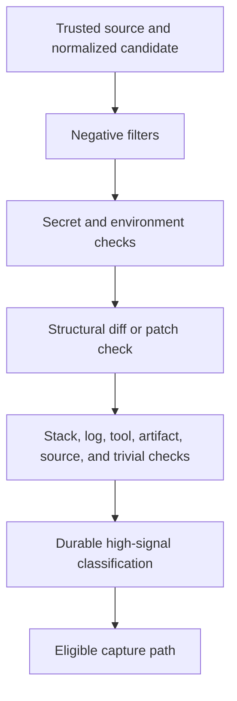

# Design: Adaptive Memory Capture Policy Markdown Lists

## Context

Capture eligibility is an ordered policy pipeline. The existing WIP introduces a dedicated structural patch predicate before durable high-signal classification. This change adopts that direction but does not treat the pre-existing implementation as completed Apply work until it is inspected under this change ID.

## Decision

Use a bounded structural heuristic:

1. Immediately recognize canonical patch markers.
2. Recognize paired removed/added file headers.
3. Recognize hunk and index markers.
4. For marker-free text, require both addition and removal lines plus sufficient block size and sign-line density.
5. Do not treat dash-only Markdown bullets as patch evidence.

This keeps the implementation local, deterministic, provider-neutral, and testable without network or model behavior.

## Policy order

The ordering is a security and provenance boundary. Durable-category recognition is not an escape hatch from negative filtering.

## Alternatives rejected

### Every dash-prefixed line is a patch line

Rejected because Markdown bullets and diff removals share the same first character. Without structural context, this rule creates predictable false positives for ordinary durable knowledge.

### Durable detection before negative filters

Rejected because high-signal words such as “decision”, “must”, or “root cause” frequently appear inside logs, source, patches, official artifacts, and sensitive material. Promoting them first would weaken policy safety.

### Disable patch detection

Rejected because patches are transient implementation artifacts and can contain source, credentials, filesystem paths, test output, or irrelevant context. Automatic capture still needs a bounded patch exclusion.

## Adoption of pre-existing WIP

Apply must begin with an adoption review rather than implementation:

1. Capture the current three-path WIP identity without changing it.
2. Compare its behavior and tests against CPML-001 through CPML-006.
3. Confirm no hunk belongs to observability receipts, same-turn repair, generated assets, or another change.
4. Record `apply.started` only at that future review time.
5. If the WIP conforms, create `apply-progress.md` stating that implementation predated this change and was adopted after inspection. Existing historical RED/GREEN evidence may be cited as prior evidence, never represented as activity performed under this change ID.
6. If source changes are required, stop until their paths are explicitly authorized.

## Privacy and security

- High-confidence secret detection and every other negative filter remain ahead of durable classification.
- Rejected candidates do not reach provider ingestion.
- Verification uses synthetic strings and fake transport only.
- No prompt, credential, path, provider response, or live memory record is persisted by this planning change.

## Compatibility

- No public type or reason-string migration is planned.
- Existing structurally recognizable patches remain rejected.
- Ordinary Markdown lists gain access only to later existing policy checks; they are not automatically eligible.
- No generated or installed runner asset is affected.

## Risks and mitigations

| Risk | Impact | Mitigation |
|---|---|---|
| Dense mixed `+`/`-` list is rejected | False negative for durable capture | Keep fallback bounded; document and review representative cases |
| One-sided marker-free patch is accepted | Transient artifact may pass this filter | Other negative filters still apply; retain explicit residual limitation |
| Durable wording bypasses safety filters | Privacy/security regression | Preserve strict negative-filter precedence and test it |
| WIP contains unrelated hunks | Ownership contamination | Stop adoption and request narrower authorization |
| Historical evidence is presented as new lifecycle activity | Traceability failure | Separate prior evidence from future Apply/Verify events explicitly |

## Rollback

After adoption, rollback uses a normal reviewed follow-up or revert of the eventual implementation commit. Registry and review history remain preserved. Destructive reset, restore, clean, or history rewriting is not part of the rollback plan.

## Code-economy note

The Full SDD exceeds the normal documentation budget because the user explicitly requested durable ownership, requirements, lifecycle, alternatives, privacy, compatibility, risks, rollback, and future verification tasks. No new runtime abstraction or dependency is proposed.
