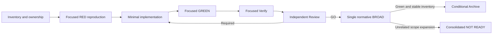

# Design: Stabilize Adaptive Memory Release Gates

## Decisions

### D1 — One release-gate stabilization owner

`deck-apply-deep` owns the entire implementation slice so diagnosis, RED/GREEN evidence, and cross-route effects stay coherent. `deck-quality` independently reviews the resulting candidate.

### D2 — Preserve architecture rather than audit exceptions

Core retains provider-neutral secret classification. A generic HTTP credential-header detector or an injected provider-neutral pattern contract is preferred over any concrete Supermemory name in Core. The purity audit remains unchanged unless Review identifies a separate test defect.

### D3 — Control process and render boundaries

Timeout behavior is tested through injectable clocks/process outcomes wherever the production API already exposes such a boundary. Mounted TUI tests synchronize on requests, deferred responses, and render flushes; an outer bounded failure diagnostic may remain, but a fixed five-second deadline is not the success mechanism.

### D4 — Baseline updates follow semantic verification

The bundle hash is an inline byte snapshot, not the product contract. Git history, current source, and the three rendered fragments establish intent before the baseline is updated through the source-owned parity test. Generated files are never hand-edited.

### D5 — No blanket historical OpenSpec suppression

Archive's mandatory BROAD requirement is satisfied by the normative repository and release commands plus focused registry validation for candidates. The validator's all-history mode is not invented as an Archive prerequisite. Existing historical debt is untouched; any new or worsened candidate validation error remains blocking.

## Verification flow

## Owned paths

The initial candidate may modify only the minimum subset proven necessary among:

- `packages/core/src/teams/developer/instruction-bundles/bundle-parity.test.ts`
- `packages/core/src/memory/managed-project-memory-recall.ts`
- `packages/core/src/memory/managed-project-memory-recall.test.ts`
- `packages/adapter-codex/src/runner-adapter.ts`
- `packages/adapter-codex/src/runner-adapter.test.ts`
- `packages/adapter-codex/src/codex-model-discovery.ts`
- `packages/adapter-codex/src/codex-model-discovery.test.ts`
- `apps/cli/src/tui/app.codex-discovery.test.tsx`
- this change's OpenSpec artifacts

Any additional production path requires causal evidence and must be recorded before editing.
