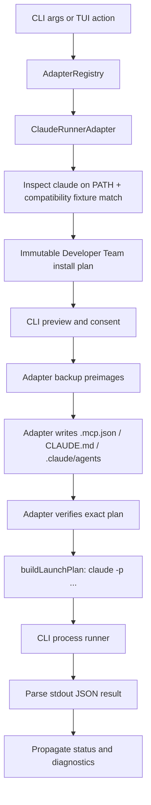

# Design: Claude Code CLI Runner Support

## Architectural decision

Unlike the Codex change, this proposal does **not** need to add or change any type in
`packages/core/src/runner-adapter.ts`. `RunnerLaunchInput`, `RunnerLaunchPlan`,
`RunnerLaunchResult`, and the full `RunnerAdapter` interface already exist in their final,
runner-neutral shape (they were built for Codex and generalized). `@deck/adapter-claude` is a
pure addition: a new package plus a small registration diff.

The one architectural decision this proposal does make explicitly, because it was genuinely
open, is **subprocess vs. Claude Agent SDK**. Decision: **subprocess** (`claude -p ...`),
launched by the CLI exactly like Pi/OpenCode/Codex.

Rationale:
- Every existing adapter conforms to "adapter plans a command, CLI spawns it, adapter never
  owns the process" (`runner-adapter.ts:732`, "The CLI remains the sole process owner"). The
  Agent SDK runs Claude in-process as a library call — there is no external command to plan.
  Fitting it into `RunnerLaunchPlan` would mean either faking a command/args shape that doesn't
  describe what actually happens, or extending the shared contract with an in-process launch
  variant that every other adapter would need to account for (dashboard rendering, doctor,
  upgrade sync, etc. all consume `RunnerLaunchPlan`).
- Every capability this proposal needs — session resume, per-launch system-prompt injection,
  structured JSON result, MCP config — is reachable through `claude -p` flags. The SDK's
  advantages (no subprocess overhead, typed config, dynamic `canUseTool` callback) matter more
  for someone building a bespoke agent than for orchestrating a user's already-installed CLI,
  which is what Deck does for every other runner.
- Lower risk, faster to a working vertical, and consistent with how Codex — the most recently
  added adapter — was actually built.

This is revisited only if a future change needs a capability that genuinely requires the SDK
(e.g., a dynamic per-tool-call approval callback that no CLI flag can express).

**Considered and rejected alternative:** a thin wrapper script that itself embeds the Agent SDK
internally, spawned as an external `command`/`args` process so it still fits
`RunnerLaunchPlan`'s literal shape. This was raised during independent review and is not
technically ruled out by the contract — but it was rejected here because it would bundle the
SDK as a Deck dependency solely for this one runner and would stop using the user's own
already-installed `claude` binary as-is, which is the property that makes the subprocess
approach simple and consistent with every other adapter. Not adopted, but recorded so the
option isn't silently unexamined.

## Target flow



## Launch contract (reused, not modified)

```ts
// Already exists in packages/core/src/runner-adapter.ts — no changes needed.
export type RunnerLaunchInput =
  | (RunnerLaunchBase & { mode: "interactive" })
  | (RunnerLaunchBase & { mode: "exec"; prompt: readonly string[]; stdin: "inherit" | "closed"; stdinPayload?: RunnerStdinPayload })
  | (RunnerLaunchBase & { mode: "resume-by-id"; sessionId: string })
  | (RunnerLaunchBase & { mode: "resume-latest" });
```

`buildClaudeLaunchPlan()` in the new adapter mirrors
`packages/adapter-codex/src/launch.ts:buildCodexLaunchPlan()` closely:

- `interactive`: `command: "claude"`, no forced flags beyond Deck's launch-policy token,
  `stdio: "inherit"`.
- `exec`: `command: "claude"`, `args` includes `-p` (print/headless) plus
  `--output-format json` (Phase 0 confirms exact flag), prompt delivered via `stdinPayload`
  (never argv), `stdio: "pipe"`.
- `resume-by-id`: adds `--resume <sessionId>` (Phase 0 confirms exact flag) after validating
  the session id is an opaque non-option value, matching Codex's validation at
  `launch.ts:100-106`.
- `resume-latest`: adds `--continue` (Phase 0 confirms exact flag).
- `interactive`/`exec` (new-session modes) pass `input.modelId` through as a `--model` flag
  when present, bounded/validated the same way as the policy token — mirroring Codex's
  `launch.ts` handling of `input.modelId`. Resume modes never reinject a model override.
- Every new-session mode gets exactly one fixed Deck-owned policy token inserted first in
  `args`, with the same `hasOwnedBypassPolicy`-style invariant check Codex uses
  (`launch.ts:74-78`) — if the check fails, return `status: "blocked"`, never launch with an
  uncertain policy.

## Deck's fixed launch-policy token (CONFIRMED in Phase 0)

Three candidate mechanisms exist in `claude --help`: `--dangerously-skip-permissions`,
`--allow-dangerously-skip-permissions` (a gate that gates the former "as an option, without it
being enabled by default"), and `--permission-mode bypassPermissions` (one enum value of the
general session-mode selector). Tested all three live rather than picking by name similarity to
Codex's `--dangerously-bypass-approvals-and-sandbox`:

- `--dangerously-skip-permissions` alone → a Bash tool call was **denied**: `"Permission for
  this action was denied by the Claude Code auto mode classifier."` — an undocumented
  automatic-safety layer that evaluates actions independent of this flag.
- `--dangerously-skip-permissions` combined with `--allow-dangerously-skip-permissions` → same
  denial, same classifier message. The "allow" flag does not change the outcome.
- `--permission-mode bypassPermissions` alone → the Bash tool call **succeeded**
  (`is_error: false`, `permission_denials: []`, `result: "Done. The command output is:
  \`hello-from-bypass-test\`"`).

**Decision:** Deck's fixed launch-policy token is `--permission-mode bypassPermissions`, not
`--dangerously-skip-permissions`. The name-similarity to Codex's flag would have been a
plausible but wrong guess — real behavior, not naming convention, decided this. This is the
value REQ-CLD-RUN-002/003 (`spec.md`) refer to as Deck's "single, fixed, adapter-owned
permission-policy token."

## Output capture — the one real design gap vs. Codex (CONFIRMED in Phase 0)

Codex's `outputCapture` contract (`runner-adapter.ts:215-224`) assumes a **file-based** final
message: Codex writes `--output-last-message <tmpfile>` and Deck reads that file after exit.

Confirmed against a live install (`claude --help` shows no `--output-last-message` or any
file-output flag at all, and a real run settled the question definitively):

```
$ claude -p --model haiku --output-format json "Reply with exactly the word: OK"
{"duration_api_ms":1840,"stop_reason":"end_turn","session_id":"fdacf75d-...",
 "total_cost_usd":0.0195328,"usage":{...},"result":"OK","is_error":false,
 "num_turns":1,"subtype":"success","type":"result","duration_ms":3126,...}
```

The full result — including the final assistant text in `result`, `session_id`, `is_error`,
`subtype`, `total_cost_usd`, and `usage` — is a single JSON object printed directly to
**stdout**. There is no file-based channel; Claude Code has no equivalent of Codex's
`--output-last-message`.

**Decision:** implement Option 1 from the original two candidates — the adapter redirects
captured stdout to a Deck-managed tmpfile itself (`stdio: "pipe"`, then the adapter writes the
captured buffer to a tmpfile before returning `outputCapture.finalAssistantMessage` with
`source: "file"`). This keeps the existing `outputCapture` contract and its consumers unchanged
everywhere else in the codebase — the only new logic lives inside `@deck/adapter-claude`. The
adapter's JSON parser MUST read `result` as the trusted final message text and MUST treat
`is_error: true` or a non-`"success"` `subtype` as a failed run rather than trusting `result`
blindly.

## Package layout

New package `packages/adapter-claude/`, mirroring `packages/adapter-codex/src/` (19 files /
~7.4k lines is the reference scale for a "beta, static-compatible" adapter — Claude's initial
release is not expected to reach that size on day one; later phases add to it):

| File | Responsibility | Codex precedent |
|---|---|---|
| `index.ts` | Barrel export | `adapter-codex/src/index.ts` |
| `types.ts` | Fixture/mutation/preimage types | `adapter-codex/src/types.ts` |
| `compatibility.ts` | Captured `claude --help` fixtures, version→feature mapping | `adapter-codex/src/compatibility.ts` |
| `launch.ts` | `buildClaudeLaunchPlan()`, argv safety invariants | `adapter-codex/src/launch.ts` |
| `mcp-config.ts` | `.mcp.json` safe merge | `adapter-opencode/src/config-merge.ts` (JSON, not Codex's TOML) |
| `claude-config.ts` | `.claude/settings.json` safe merge | same pattern as above |
| `developer-team-install.ts` | `CLAUDE.md` marker-span merge + `.claude/agents/*.md` generation | `adapter-codex/src/developer-team-install.ts` (`AGENTS.md` marker span) |
| `instruction-translation.ts` | Near-identity pass-through + forbidden-terms validator | `adapter-codex/src/instruction-translation.ts` |
| `preflight.ts` | Detect `~/.claude/`, project `.claude/`, existing files | `adapter-codex/src/preflight.ts` |
| `team-catalog.ts`, `local-only.ts`, `transaction.ts` | Thin support modules | same names in `adapter-codex` |
| `runner-adapter.ts` | Composes the above into `RunnerAdapter` | `adapter-codex/src/runner-adapter.ts` |

`package.json`: `@deck/adapter-claude`, depends on `@deck/core` (and `@deck/sdd-runtime` only
if Developer Team install machinery needs it, per Codex's dependency list).

## Registration

One diff in `apps/cli/src/runner-adapters.ts`:

```ts
import { createClaudeRunnerAdapter } from "@deck/adapter-claude";
// ...
registry.register("claude", createClaudeRunnerAdapter({ /* shared deps, e.g. webSearchProviderResolver */ }));
```

Plus one optional field added to `DefaultAdapterRegistryOptions`. No other file changes.

## Config merge strategy

`.mcp.json` and `.claude/settings.json` are JSON, structurally closer to OpenCode's
`opencode.json` than to Codex's TOML. Reuse the safe read/merge/write approach proven in
`packages/adapter-opencode/src/config-merge.ts` rather than inventing a new merge strategy or
adopting Codex's source-range-aware TOML parser (`toml-eslint-parser`), which is unnecessary
here.

`CLAUDE.md` is free-text markdown, structurally like Codex's `AGENTS.md`. Reuse an
owned-marker-span merge (locate or insert an exact Deck marker block, preserve everything
outside it) rather than a blind overwrite — same principle as Codex's `AGENTS.md` handling,
simpler than Codex's TOML range-ownership because markdown has no schema to preserve beyond the
marker boundaries themselves.

## Deferred: trusted execution boundary

Codex's design required identifying a trusted runner-host bridge (dossier continuity, one-use
invocation authorization, controlled effects) before any first-class claim. This proposal does
not attempt that for Claude Code's initial release — Claude Code's hook system (`PreToolUse`,
`PostToolUse`, `SessionStart`, etc.) is a plausible future candidate surface, but evaluating it
is out of scope here (see proposal.md). The initial release is `static-compatible` by design,
not by omission — this must be stated explicitly in the capability catalog as a gap entry
(REQ-CLD-DOC-002) and reflected honestly in the support-matrix docs (REQ-CLD-DOC-001).
